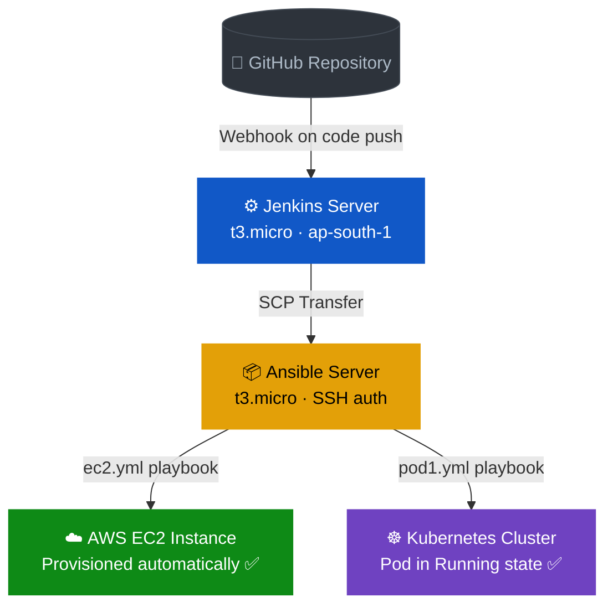
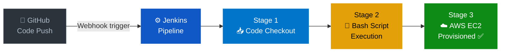
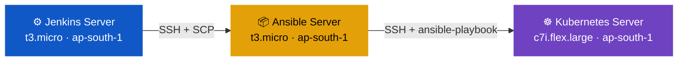
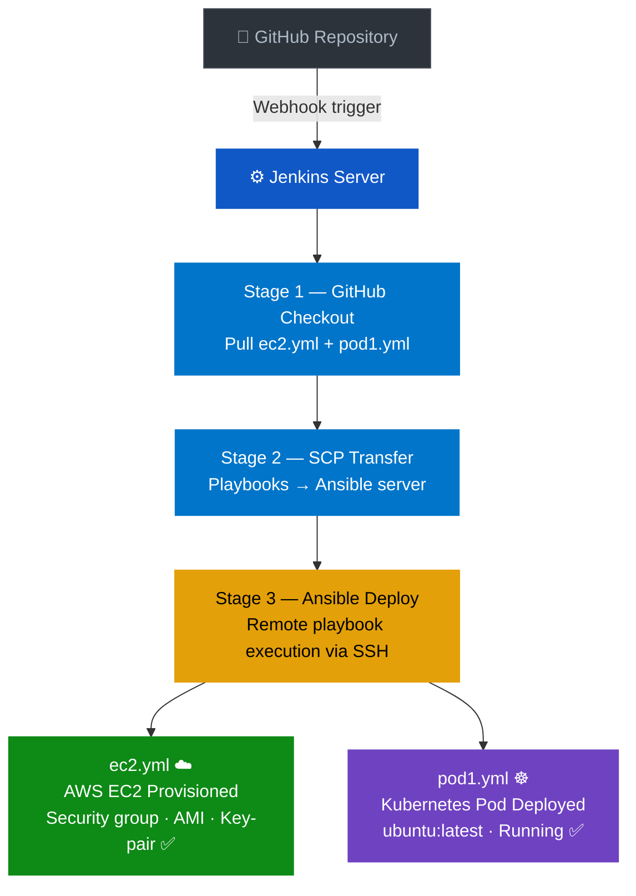

# AWS + Kubernetes CI/CD Automation Project

> End-to-end CI/CD pipeline using **Jenkins · Ansible · Kubernetes · AWS EC2** — fully automated, zero manual steps

<br>

<div align="center">

| | Project 1 | Project 2 |
|:---:|:---:|:---:|
| **Goal** | Auto-provision AWS EC2 instances | Deploy Kubernetes pods remotely |
| **Trigger** | GitHub Webhook | GitHub Webhook |
| **Key Tools** | Jenkins + Bash Scripts | Jenkins + Ansible + Kubernetes |
| **Result** | ✅ EC2 running in under 3 min | ✅ Kubernetes pod Running state |

</div>

---

## 🏗️ Overall Architecture



---

## 📁 Project 1 — Automated AWS EC2 Provisioning via Jenkins CI/CD

**Automate AWS EC2 instance provisioning using Jenkins and parameterised Bash scripts — eliminating 100% of manual AWS Console steps.**

<br>

### 🔧 Tools Used


<br>

### Pipeline Flow



<br>

### Step-by-Step Breakdown

**① GitHub Webhook Trigger**
Developer code push karta hai → GitHub Webhook automatically Jenkins pipeline trigger karta hai. Koi manual build start nahi karna padta — fully event-driven execution.

**② Jenkins Pipeline — 3 Automated Stages**
Stage 1: GitHub se code checkout.
Stage 2: Parameterised Bash shell scripts execute.
Stage 3: AWS CLI commands se EC2 provision.

**③ AWS IAM Least-Privilege Access**
Jenkins server ko EC2 provision karne ke liye IAM role assign ki — minimum permissions enforce ki. Cloud security best practices follow ki gayi.

**④ EC2 Instance Running — Verified**
2 GitHub repositories pe version-controlled auditability. Provisioning time 15+ minutes se ghatkar under 3 minutes.

<br>

### Jenkins Pipeline Code

```groovy
node {
  stage('GitHub connect') {
    git branch: 'main',
    url: 'https://github.com/PushpenderKumar7505/Devops-automation-jenkins-ansible.git'
  }
  stage('Provision EC2') {
    sh 'bash provision_ec2.sh'   // parameterised Bash script
  }
}
```

<br>

> [!TIP]
> ✅ **Result** — AWS EC2 instance provisioned automatically in under 3 minutes · 100% manual steps eliminated · IAM least-privilege enforced · Fully event-driven via GitHub Webhooks

---

## ☸️ Project 2 — 3-Tier CI/CD: Jenkins + Ansible + Kubernetes

**Deploy Kubernetes pods remotely using a 3-tier CI/CD pipeline across 3 AWS EC2 instances.**

<br>

### 🔧 Tools Used


<br>

### Infrastructure — 3 AWS EC2 Instances



<br>

### Pipeline Flow



<br>

### Step-by-Step Breakdown

**① Jenkins — GitHub Code Checkout (Stage 1)**
GitHub se latest code pull karta hai. Ansible playbook files `ec2.yml` aur `pod1.yml` repository mein stored hain.

**② SCP File Transfer to Ansible (Stage 2)**
Jenkins workspace se playbook files SCP ke through Ansible server pe transfer hoti hain. SSH Agent plugin se passwordless authentication.

**③ Ansible Playbook Execution (Stage 3)**
Jenkins SSH se Ansible server pe connect karta hai aur remotely playbook run karta hai.
- `ec2.yml` — AWS EC2 provision karta hai (security group creation, AMI selection, key-pair configuration)
- `pod1.yml` — Kubernetes server pe pod remotely deploy karta hai

**④ Passwordless SSH — Ansible → Kubernetes**
SSH key-pair generate karke `authorized_keys` mein add kiya. Verification:
```bash
ansible -m ping   # → 0 failures confirmed
```

**⑤ Kubernetes Pod — Running State Verified**
`ubuntu:latest` image se multi-container pod deploy hua. `kubectl get pods` se Running state confirm kiya. MobaXterm se 3 nodes simultaneously manage kiye.

<br>

### Jenkins Pipeline Code

```groovy
node {
  stage('Github connect') {
    git branch: 'main',
    url: 'https://github.com/PushpenderKumar7505/Devops-automation-jenkins-ansible.git'
  }
  stage('ansible-server') {
    sshagent(['ansible']) {
      sh 'scp /var/lib/jenkins/workspace/Aws-project/* ubuntu@<ansible-ip>:/home/ubuntu'
    }
  }
  stage('ansible deploy') {
    sshagent(['ansible']) {
      sh 'ssh ubuntu@<ansible-ip> ansible-playbook ec2.yml'
      sh 'ssh ubuntu@<ansible-ip> ansible-playbook pod1.yml'
    }
  }
}
```

### Ansible Playbook — ec2.yml

```yaml
- hosts: localhost
  tasks:
    - name: Provision EC2 instance
      amazon.aws.ec2_instance:
        name: "ansible-managed"
        instance_type: t3.micro
        image_id: <ami-id>
        region: ap-south-1
        key_name: <key-pair>
        security_group: devops-sg
        state: present
```

### Ansible Playbook — pod1.yml

```yaml
- hosts: kubernetes
  tasks:
    - name: Deploy Kubernetes pod
      command: kubectl apply -f pod-config.yml
```

<br>

> [!TIP]
> ✅ **Result** — EC2 instances provisioned + Kubernetes pod Running state confirmed · Passwordless SSH between all 3 nodes · `ansible -m ping` → 0 failures · All manual steps eliminated · Multi-node management via MobaXterm

---

## ⚙️ Complete Tech Stack

| Category | Tools |
|---|---|
| CI/CD & Automation |   |
| Configuration Management |  SSH Key Auth · Ansible Playbooks |
| Container Orchestration |  kubectl · Pods · Deployments |
| Cloud Platform |  EC2 · IAM · S3 · VPC · CloudWatch |
| Scripting & OS |   |
| Version Control |   |
| Networking | SSH · SCP · Passwordless Authentication |
| Tools | MobaXterm · python3-boto |

---

## 📸 Project Screenshots

| Screenshot | Description |
|---|---|
| `P1-01-jenkins-dashboard.png` | Jenkins dashboard overview |
| `P1-02-jenkins-pipeline-overview.png` | Pipeline stages view |
| `P1-03-jenkins-pipeline-config.png` | Pipeline configuration |
| `P1-04-jenkins-build-history.png` | Successful build history |
| `P1-05-ansible-ec2-playbook.png` | ec2.yml playbook execution output |
| `P2-01-kubernetes-pod-running.png` | Pod in Running state — kubectl verified |
| `P2-02-ansible-pod-deploy-recap.png` | Ansible pod deployment recap |
| `P2-03-jenkins-k8s-pipeline-config.png` | Jenkins K8s pipeline config |
| `P2-04-jenkins-both-projects.png` | Both projects in Jenkins |
| `P2-05-aws-ec2-3-instances.png` | 3 EC2 instances running in AWS Console |
| `P2-06-jenkins-both-projects-2.png` | Jenkins dashboard with both pipelines |
| `P2-07-mobaxterm-sessions.png` | MobaXterm multi-node SSH sessions |

---

## 👨‍💻 Author

**Pushpender Kumar** — B.Tech CSE, GLA University 2024

[](https://linkedin.com/in/pushpender-kumar-5280b7226)
[](https://github.com/PushpenderKumar7505)
[](mailto:pushpender7505@gmail.com)
